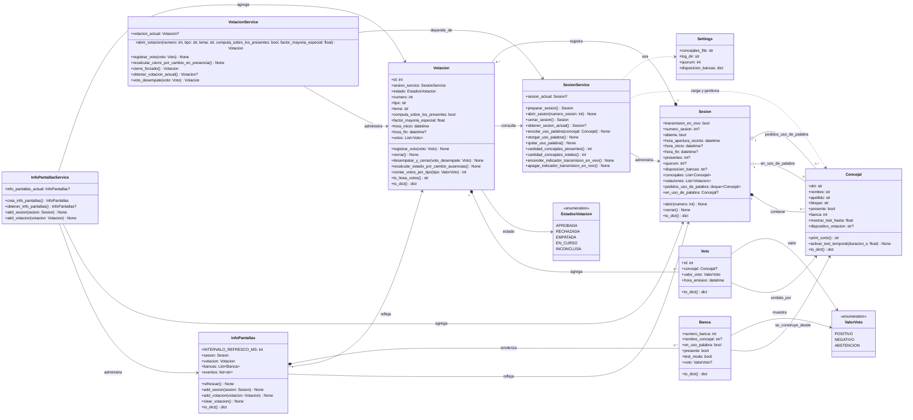

# Diagrama de clases

Este diagrama resume las clases principales del backend y sus relaciones de dominio y servicio.

## Alcance

El diagrama incluye:

- Clases de dominio en `app/models`
- Servicios con estado en `app/services`
- Enums relevantes para el flujo de votación

Quedaron fuera:

- Módulos funcionales sin clases, como `input_service.py` y `concejal_service.py`
- Rutas FastAPI y frontend estático

## Notas

- `SesionService`, `VotacionService` e `InfoPantallasService` se usan en la app como singletons de módulo.
- `Votacion` depende de `SesionService` para consultar la sesión abierta y recalcular cierres.
- `InfoPantallas` funciona como proyección de lectura del estado de `Sesion` y `Votacion`.
